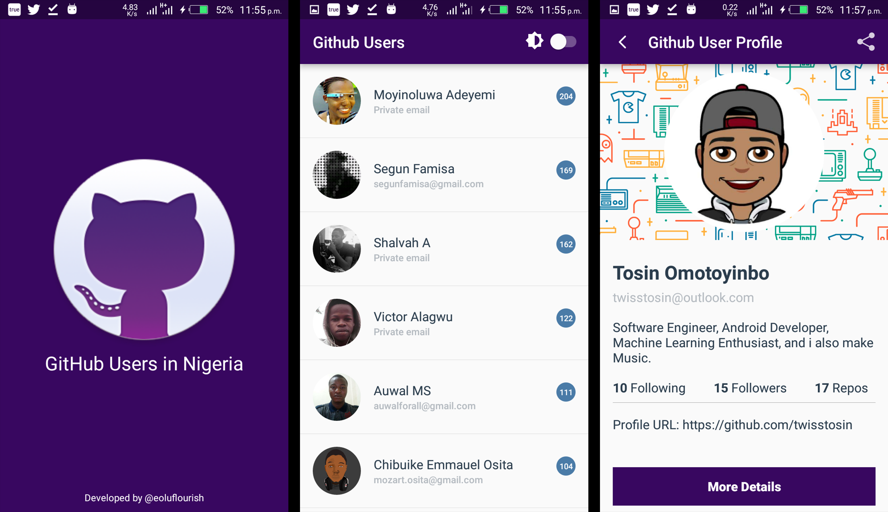
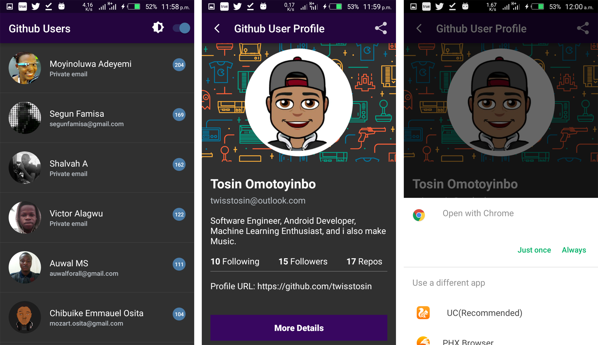
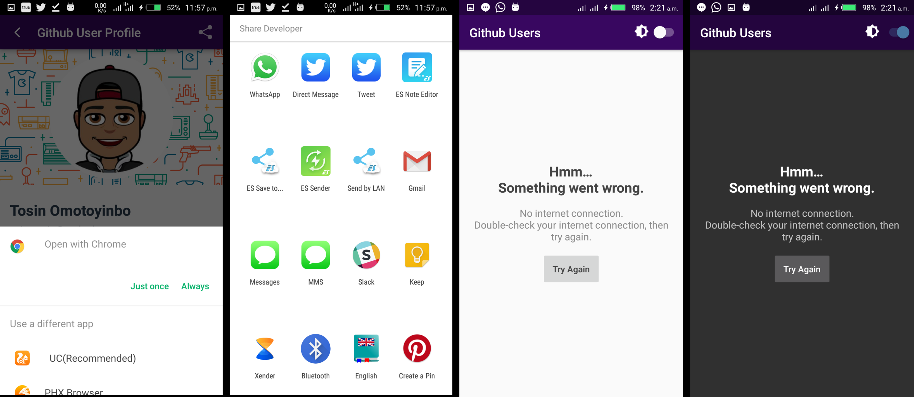

GitHub Users App  
===================================

This app displays the list of Github users in lagos that code in java.

Each user has a profile page which contain some details of the user.

- Githup API: https://plus.google.com/communities/105153134372062985968

Feature of the App
------------------

- For Night Mode App users like me, the app supports toggling between DAY MODE and NIGHT MODE theme

Screenshots of the app
----------------------

- Splash Screen, List of Github users, User Profile [Day Mode]

- List of Github users, User Profile, Share Developer [Night Mode]

- Open Developer Profile Link , Share Developer, Empty States [Day/Night Mode]

